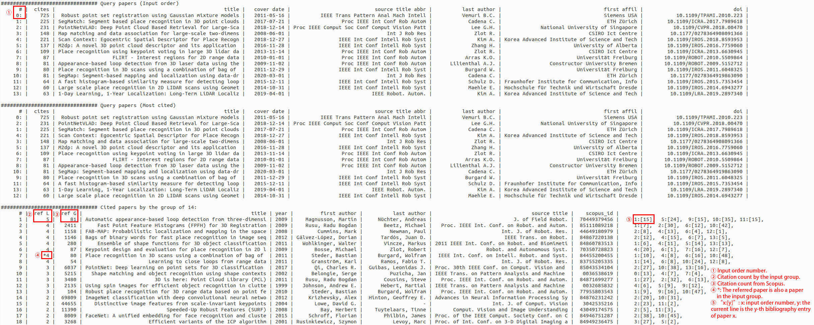

# citation-graph

## What

Find publications commonly cited by a group of papers, and more.

Specifically, it parses the data from [Scopus](https://www.scopus.com/)
via [pybliometrics](https://github.com/pybliometrics-dev/pybliometrics) to

1. Get the bibliography of an input paper.
2. Find common references of all input papers.
3. List the commonly cited ones, see if you miss some important papers.
4. Sort papers by citation counts.
5. Save metadata into markdown files for latter usage (e.g. paper notes).

## Why

It would be easier for researchers to start in a new area if they know the relationship (cross reference) and
importance (citations) of a bunch of related papers.

## How

1. Create developer account at [Scopus/Elsevier](https://www.scopus.com/).
    1. You have 10000 requests/week as a free user.
2. Install [pybliometrics](https://github.com/pybliometrics-dev/pybliometrics).
3. Make sure your institution has bought the database.
4. Edit and run the script in your institution network.

## Sample output

E.g., if I am interested in LiDAR loop closure detection and I find the DOIs of some papers, the sample output (please use full width terminal):

